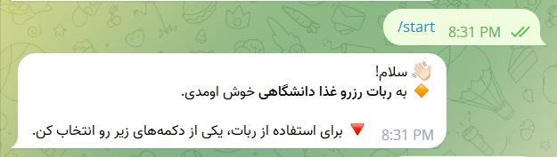
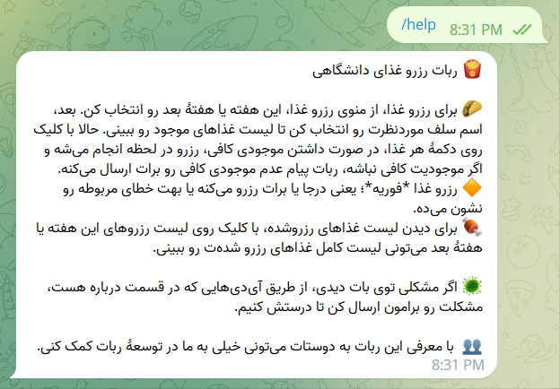

# University Meal Reservation
This Telegram bot allows you to reserve meals at your university. It's a convenient and easy way to make sure you have a meal waiting for you when you're hungry.


## Features
- Reserve foods
- Auto reserve foods
- Show reserved foods
- Share forgot code
- Change cv2 password
- Show recent actions


## Documentation
See [How to Use The Bot](https://linktodocumentation) for working with the **University Meal Reservation** bot.

## Run Locally
1. Clone the project:
    ```bash
      git clone https://github.com/MatinGhanbari/UniversityMealReservation.git
    ```

2. Go to the project directory:
    ```bash
      cd UniversityMealReservation
    ```

3. Create your config file:
    ```bash
      config.json
    ```

4. Start the bot:
    ```bash
      python src/main.py
    ```


## Running Tests
1. Go to the project directory.
2. To run tests, run the following command:
    ```bash
      python src/tests.py
    ```


## Contributing
Contributions are always welcome!

Please see [CONTRIBUTING.md](CONTRIBUTING.md) for ways to get started.

## Authors
- [@MatinGhanbari](https://www.github.com/MatinGhanbari)

## FAQ

#### Q: Is my password secure in this bot?
- A: Yes, your password is hashed using a strong algorithm to make it secure. This means that your password is converted into a string of random characters that cannot be easily reversed. Even if someone were to gain access to our database, they would not be able to read your password.

    
#### Q: What happens to my data when I log out of the bot? 
- A: When you log out of the bot, your personal information, such as your username and password, is deleted from the bot's database. This ensures that your data is protected and cannot be accessed by others.

## Screenshots
| Commands    | Screenshots |
|-------------| ------------- |
| Start |  |
| Help |  |

## Support & Feedback
If you have any support questions or feedback, please reach out to us in the bot's support section using the `/support` command. (Please include images when they enhance the content.)
